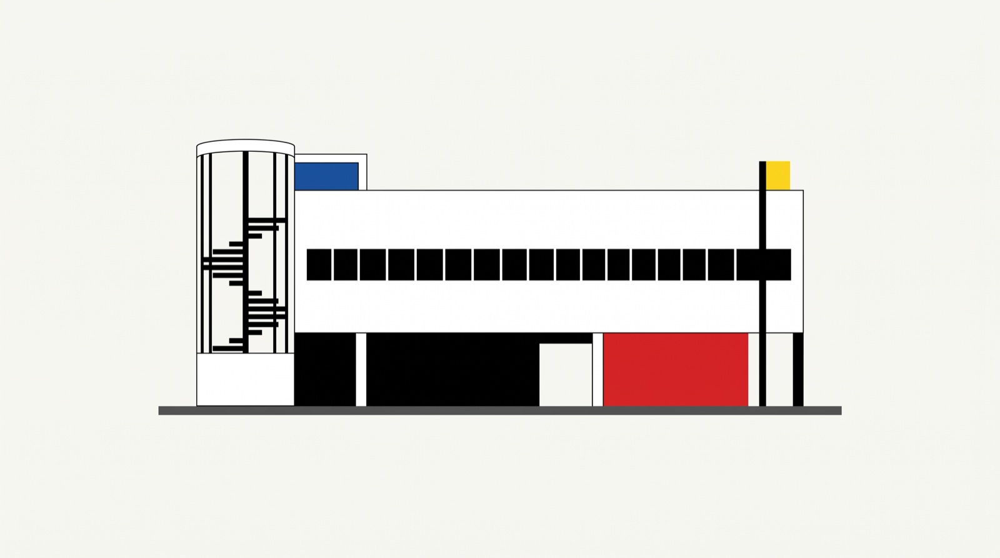

<p align="center">
  
</p>

# plugins

Plugins y skills de [Claude Code](https://claude.com/claude-code) de Gonzalo Verdugo, listos para
instalar.

| | |
|---|---|
| **Qué es** | Marketplace público de Claude Code `gv-plugins` |
| **Estado** | Activo; todavía sin plugins publicados |
| **Stack** | Plugins, skills y agentes en markdown; scripts sin dependencias |
| **Repo** | `gverdugo-dev/plugins`, público |
| **Forma parte de** | `personal-public-resources`, el contenedor de recursos personales |

## Qué hace

Solo contiene lo que ya está terminado y probado. Cada plugin trae su propio `README.md` con lo
que hace y cómo se usa.

| Plugin | Qué hace | Skills |
|--------|----------|--------|
| - | _Todavía no hay ninguno publicado._ | - |

## Cómo se usa

```bash
claude plugin marketplace add gverdugo-dev/plugins
claude plugin install <plugin>@gv-plugins
```

## Estructura

```
.claude-plugin/marketplace.json   # manifiesto del marketplace gv-plugins
docs/                             # esta cabecera
plugins/
└── <plugin>/
    ├── .claude-plugin/plugin.json
    ├── skills/<skill>/SKILL.md
    ├── agents/<agente>.md        # opcional
    └── README.md
```

## Cómo encaja

El desarrollo ocurre en un repositorio aparte y solo llega aquí lo que está terminado. Publicar
una actualización es hacer push: los `plugin.json` no llevan versión y el harness usa el SHA del
commit.

## Más información

El procedimiento para recibir un plugin y las convenciones están en `CLAUDE.md`.
